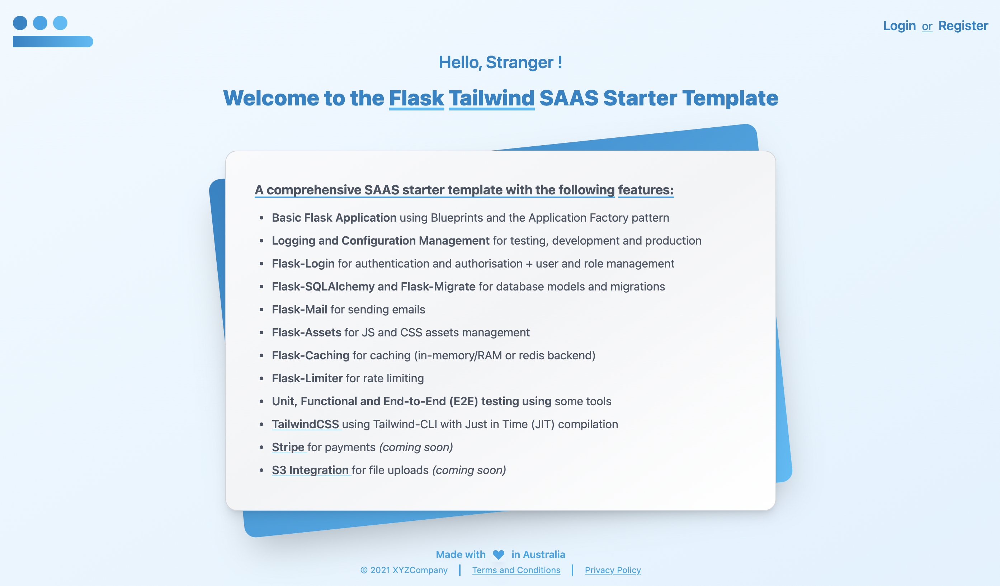

# (WORK IN PROGRESS) Flask and TailwindCSS SAAS App Starter Template

## THIS TEMPLATE IS A WORK IN PROGRESS

## How to use

1. Clone this repo and create a virtual environment (`python3 -m venv venv`) for use with this application.
2. Activate the virtual environment (`source venv/bin/activate`) and run `pip install -r requirements.txt` to install package dependencies.
3. Download the [TailwindCSS standalone build tool](https://tailwindcss.com/blog/standalone-cli) and place the executable in the project folder.
4. In one terminal - run `./tailwindcss -i ./app/static/src/css/tailwind.css -o ./app/static/src/css/index.css --watch`. This will start the Tailwind JIT Watcher and will compile your CSS on the fly.
5. In the second terminal - setup some ENV variables required to run the Flask application:
   - Run `export FLASK_APP=run.py` (use `set` instead of `export` for windows)
   - Run `export FLASK_ENV=development`
   - Customise the application configuration in `config.py` as per your requirements
   - Run `flask db upgrade` to intialise database
   - Run `flask run` to start the Flask development server
6. You can now add/remove CSS in your jinja templates, it will be auto-compiled by the compiler running in step 4. You will see the Tailwind CSS styles when you refresh your browser (Flask server) window.
7. Before deploying to production:
   - Stop the flask server and the Tailwind CLI build tool.
   - Run `flask assets clean` followed by `flask assets compile` to prepare the CSS and JSS assets for production
8. Deploy to production. Enjoy!
